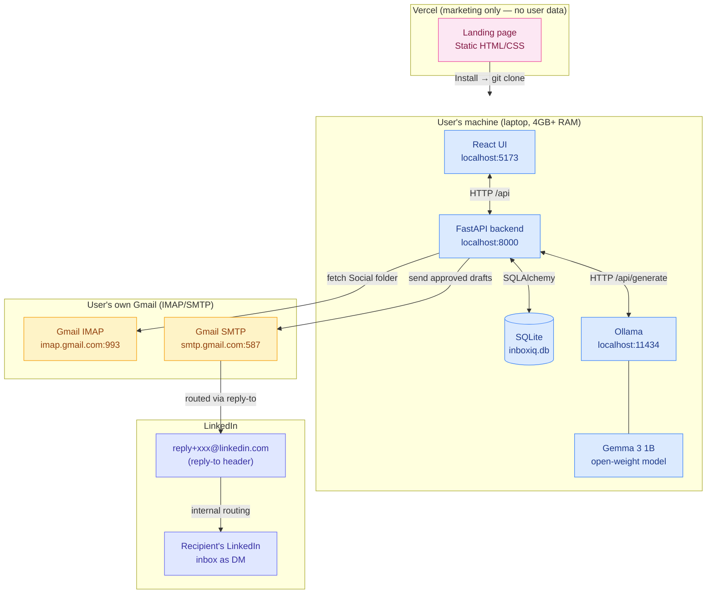
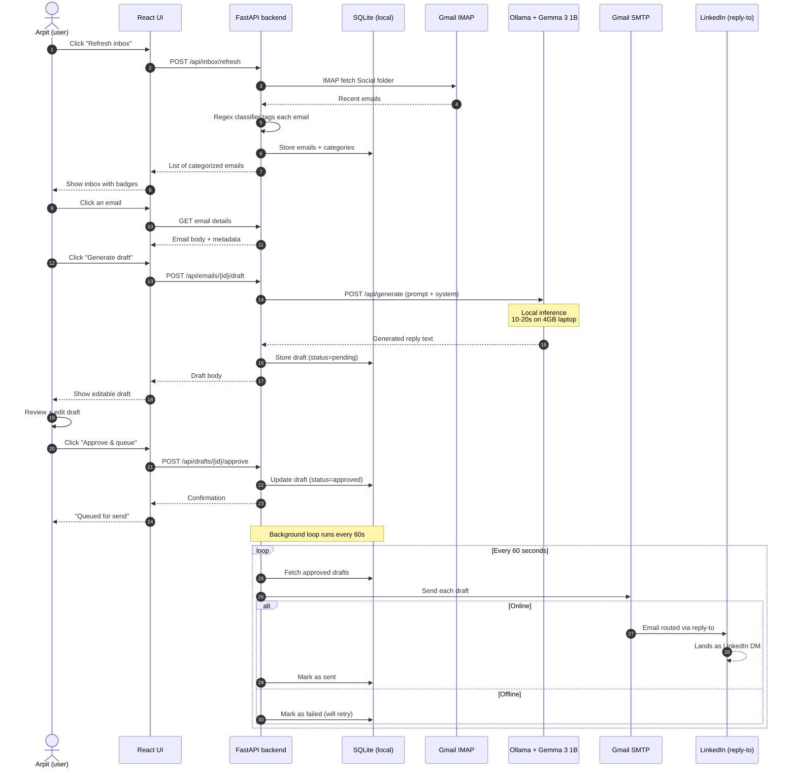

# Offmail

[](https://github.com/Qisanxi/Offmail/actions/workflows/test.yml)
[](https://opensource.org/licenses/MIT)
[](https://ai.google.dev/gemma)
[](https://hacktoberfest.com)
[](#why-this-exists)
[](CONTRIBUTING.md)

>Offmail reads your Gmail's Social tab locally, detects LinkedIn "connection accepted" emails, drafts a personalized reply using **Gemma 3 1B** running on your laptop via Ollama, and you hit send — routed via LinkedIn's `reply-to` email address so it lands as a LinkedIn DM. Your inbox never leaves your machine.

Submitted for the **Hacktoberfest 2026 Weekend DEV Challenge** — theme: *Build for a Friend*.


## Why this exists

Closed inbox-AI tools (Superhuman, Shortwave, etc.) read your emails on their servers. That means:

- Your private recruiter conversations sit in someone else's database
- They cost $20–30/month forever
- They stop working the moment you stop paying
- You can't audit how your data is used

Offmail flips that:

| Hacktoberfest prompt question | Offmail's answer |
|---|---|
| Does it run on a laptop with no internet? | **Yes** — Ollama + Gemma 3 1B run locally; drafting works offline |
| Keep someone's data off a server they don't control? | **Yes** — there is no Offmail server. Each user runs their own copy |
| Let you fine-tune, swap models, or change behavior? | **Yes** — any Ollama model works; change one env var |
| Cost nothing to run? | **Yes** — every component is free and open source |
| Where did open beat closed? | Cost, privacy, auditability — see [comparison table](#hacktoberfest-compliance) below |

---

## Architecture diagram



**Key points:**
- The Vercel homepage is static marketing — **no user data ever touches it**
- Every component on the user's machine runs on `localhost` — no external API calls except IMAP/SMTP to the user's own Gmail
- The `reply-to` trick routes replies through LinkedIn's published email address → lands as a LinkedIn DM (no scraping, no API ToS violations)

---

## User flow diagram



---

## Quickstart

### Prerequisites
- Python 3.10+
- Node.js 22.12+ (Vite 8 requires Node 20.19+ or 22.12+)
- [Ollama](https://ollama.ai) installed
- A Gmail account with IMAP enabled + an [app password](https://myaccount.google.com/apppasswords)

### 5-minute install

```bash
# 1. Clone
git clone https://github.com/Qisanxi/Offmail.git
cd Offmail

# 2. Configure
cp .env.example .env
# Edit .env — add your Gmail address + 16-char app password

# 3. Pull the model (~800MB, one-time)
ollama pull gemma3:1b

# 4. Install deps + run
make setup    # pip install + npm install
make run      # starts FastAPI :8000 + Vite :5173 + checks Ollama
```

Open http://localhost:5173 — you should see the Offmail UI.

---

## How it works

### 1. Poll Gmail Social category via IMAP + X-GM-RAW
Using `imap-tools`, we fetch the Social category via Gmail's `X-GM-RAW "category:social"` search extension. Gmail doesn't expose Social/Promotions as IMAP folders — they're labels — so we use the X-GM-RAW extension to filter within INBOX.

### 2. Classify locally (regex, no LLM, sender-restricted)
A regex-based classifier tags each email as:
- `linkedin_accepted` — LinkedIn "accepted your invitation" notifications (sender must be `linkedin.com`)
- `needs_reply` — emails with reply-intent phrases ("please reply", "let's schedule a call")
- `fyi` — digests, no-reply, "people you may know" (subject + sender only, not body)
- `unknown` — everything else

The classifier is sender-aware: a newsletter quoting "accepted your invitation" is NOT misclassified because we require the From domain to be `linkedin.com`.

### 3. Draft with Gemma 3 1B (local)
A tight system prompt enforces tone, length, content rules. Email body is treated as untrusted data (delimited in the prompt to prevent prompt injection). Output is trimmed to last complete sentence to avoid mid-sentence truncation from `num_predict`.

### 4. User reviews → approves → queued
You edit the draft if needed, hit "Approve & queue". Draft is stored in SQLite with status `approved`. After rejecting a draft, you can regenerate with one click.

### 5. Background sender flushes queue (atomic claim, no double-send)
An asyncio loop runs every 60 seconds. It atomically transitions drafts from `approved` → `sending` via an atomic `UPDATE ... WHERE status='approved'` query — preventing the race condition where the background loop and a manual flush both pick the same draft. After send, status moves to `sent` (success) or `failed` (with backoff retry).

### 6. Reply routes via LinkedIn's `reply-to` (sender-authenticated)
The `To` header on the outgoing email is set to LinkedIn's `reply+xxx@linkedin.com` address (extracted from the original email's `Reply-To` header, parsed with `email.utils.parseaddr` to handle `Name <addr>` format). The message lands as a LinkedIn DM.

We only treat an email as LinkedIn acceptance if the sender domain is `linkedin.com`. A spoofed email from `attacker@evil.com` containing "accepted your invitation" will NOT trigger LinkedIn routing.

### 7. Offline-first queue with exponential backoff
If you approve a draft while offline, SMTP fails — but the draft stays in the queue as `failed` with a backoff schedule (60s, 120s, 240s, 480s, 960s). The background loop auto-retries. After 5 attempts, the draft moves to `dead` state and requires manual retry.

### Security model
- **Bound to 127.0.0.1 only** — not exposed to LAN
- **TrustedHostMiddleware** rejects requests with foreign Host headers (DNS-rebinding defense)
- **Per-install X-Offmail-Token header** required on all mutating routes (CSRF defense — cross-site POSTs can't set custom headers)
- **Header injection rejected** — EmailMessage with modern policy + manual CR/LF stripping

---

## Project structure

```
offmail/
├── README.md                  # this file
├── LICENSE                    # MIT
├── .env.example               # template for env vars
├── .gitignore
├── Makefile                   # setup, run, test, lint
├── .github/
│   └── workflows/
│       └── test.yml           # CI: Python tests + frontend build check
│
├── backend/                   # FastAPI Python backend
│   ├── __init__.py
│   ├── main.py               # API routes + lifespan + middleware
│   ├── auth.py               # per-install X-Offmail-Token (CSRF defense)
│   ├── config.py             # env loading (dataclass-based)
│   ├── db.py                 # SQLAlchemy engine + session + init_db()
│   ├── models.py             # Email, Draft, Contact + DraftStatus (sending/dead)
│   ├── imap_client.py        # Gmail Social polling via X-GM-RAW search
│   ├── classifier.py         # sender-aware regex classifier
│   ├── llm.py                # Ollama + Gemma wrapper (timeout/404/empty guarded)
│   ├── smtp_sender.py        # EmailMessage builder + header injection guard
│   ├── send_queue.py         # atomic claim + backoff retry + DEAD state
│   ├── requirements.txt
│   └── tests/                # 25 tests (classifier, smoke, smtp_sender)
│
├── frontend/                  # React + Vite 8 + Tailwind v4 (JavaScript, no TS)
│   ├── index.html             # Single Vite entry — renders <App /> with React Router
│   ├── vite.config.js        # Vite + React (Oxc) + Tailwind v4 plugins
│   ├── vercel.json           # SPA routing fallback (so /app works on direct visit)
│   ├── package.json
│   └── src/
│       ├── main.jsx          # React entry
│       ├── App.jsx           # <BrowserRouter> + <Routes> — /, /app
│       ├── index.css        # Tailwind v4 (CSS-first config via @theme + @utility)
│       ├── lib/api.js        # API client with JSDoc types
│       ├── pages/
│       │   ├── HomePage.jsx  # Marketing landing page (dark theme)
│       │   └── AppPage.jsx   # Inbox triage UI (the actual app)
│       ├── styles/
│       │   └── landing.css   # Homepage dark-theme styles (imported by HomePage.jsx)
│       └── components/
│           ├── InboxList.jsx
│           ├── EmailCard.jsx
│           ├── SendQueue.jsx
│           ├── HealthBar.jsx
│           └── Badges.jsx
│
└── docs/
    ├── ARCHITECTURE.md       # detailed design notes for DEV post
    └── DEV_POST_DRAFT.md      # full draft of the DEV post
```

---

## Hacktoberfest compliance

### Eligibility for "Best Use of Gemma" prize ($200)

✅ Uses **Gemma 3 1B** (Google's open-weight model) via Ollama (open-source runtime)

### Open beats closed — direct comparison

| Closed approach | Offmail (open) |
|---|---|
| Superhuman: $30/month, reads emails on their servers | $0/month, reads emails on your laptop |
| OpenAI GPT-4 API: $0.01–0.05 per email, data goes to OpenAI | Gemma 3 1B local: $0 per email, data never leaves |
| LinkedIn Sales Navigator: $99/month, doesn't integrate with email | Free, integrates directly with Gmail's IMAP/SMTP |
| Cannot audit how SaaS uses your data | Code is open on GitHub — read every line |

### How Offmail answers the Hacktoberfest prompt

| Prompt question | Answer |
|---|---|
| Runs on a laptop with no internet? | **Yes** — drafting works offline (Ollama is local) |
| Keeps data off a server they don't control? | **Yes** — there is no Offmail server |
| Lets you swap models? | **Yes** — change `OLLAMA_MODEL` env var to `phi3:mini`, `llama3.2:1b`, etc. |
| Costs nothing to run? | **Yes** — all components are free and open source |
| Open approach worked better than closed? | **Yes** — see table above |

---

## Roadmap

### v1 (current — Hacktoberfest submission)
- ✅ Single React app with React Router: `/` (homepage) + `/app` (triage interface)
- ✅ Reads Gmail Social category via IMAP + X-GM-RAW search
- ✅ Sender-restricted regex classifier (LinkedIn accepted / needs-reply / FYI)
- ✅ Drafts with Gemma 3 1B via Ollama (local)
- ✅ User reviews → approves → queued
- ✅ Background sender with atomic claim (no double-send) + exponential backoff retry
- ✅ Offline-first: drafts queue when offline, auto-send on reconnect
- ✅ Reply routes via LinkedIn's reply-to email → lands as LinkedIn DM
- ✅ Security: 127.0.0.1 bind, TrustedHostMiddleware, per-install X-Offmail-Token (CSRF defense)

### v2 (post-Hacktoberfest)
- Tauri-based desktop installer (one-click install instead of `git clone + make run`)
- System tray daemon (auto-start on boot, polls Gmail every N minutes)
- Multi-account support (handle multiple Gmail inboxes)
- OAuth for Gmail (instead of app passwords)
- Switch SQLite → Postgres (already installed) for multi-user sync
- Optional encrypted cross-device sync server (Render)
- Additional routes: /settings (Gmail creds, Ollama model picker), /history (sent drafts archive), /contacts (per-person draft history)

### v3
- Mobile companion (React Native + llama.cpp for on-device inference)
- Twitter follow-back detection (same pattern, different email source)
- GitHub sponsor / star notifications
- Calendar integration (draft replies that propose times)

---

## Privacy & security

- **No central server.** The deployed Vercel homepage is marketing only — no user data ever touches it.
- **No telemetry.** Zero analytics, zero call-home. Audit the code yourself.
- **Your Gmail credentials stay on your machine** in `.env` (gitignored).
- **Your emails stay on your machine** in local SQLite (`offmail.db`, gitignored).
- **The only network calls** are IMAP (fetch) and SMTP (send) to your own Gmail. Both use your own app password.

---

## Contributing

PRs welcome. Please:
1. Fork the repo
2. Create a feature branch (`git checkout -b feat/my-feature`)
3. Run `make test` and `make lint` before submitting
4. Open a PR with a clear description

See [ARCHITECTURE.md](docs/ARCHITECTURE.md) for design context.

---

## License

MIT — see [LICENSE](LICENSE). Fork it, ship it, make it yours.

---

## Built for Arpit

> *"He sends 20+ connection requests a week. When recruiters and founders accept, he means to reply — but the friction kills the moment. Offmail removes the friction, and keeps his inbox on his laptop where it belongs."*

Built with 💙 for the **Hacktoberfest 2026 Weekend DEV Challenge** — theme: *Build for a Friend*.
