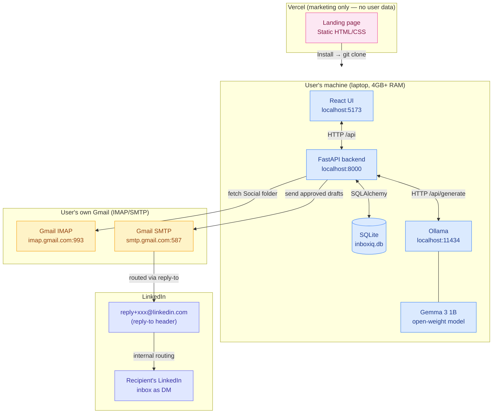
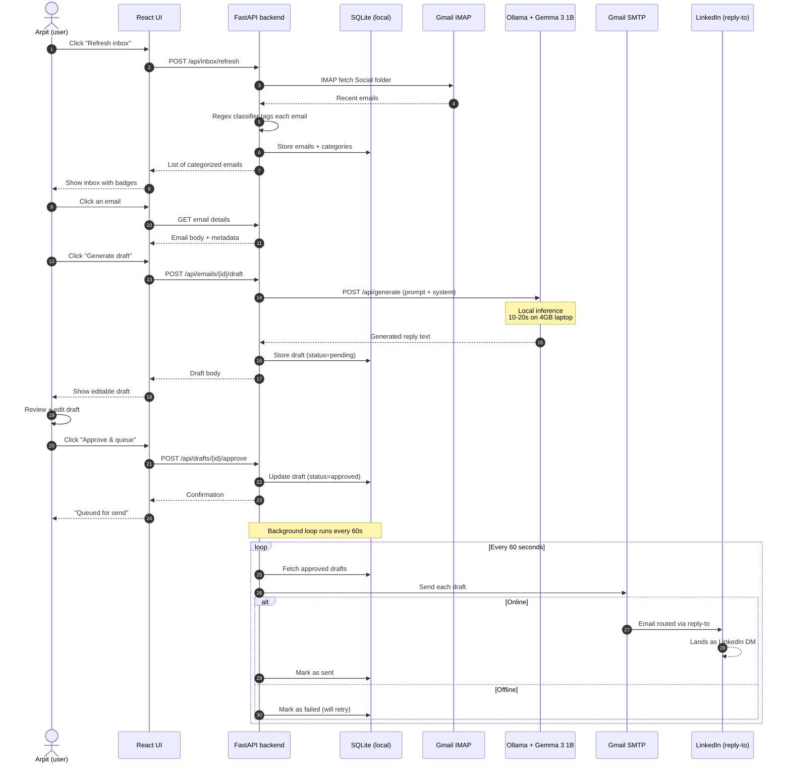

# Offmail

> Local-first email triage for job seekers. Built for **Arpit** — a job seeker who sends 20+ LinkedIn connection requests a week and never manages to reply when recruiters accept.

[](https://github.com/Qisanxi/Offmail/actions/workflows/test.yml)
[](https://opensource.org/licenses/MIT)
[](https://www.python.org/downloads/)
[](https://nodejs.org/)
[](https://ai.google.dev/gemma)
[](https://hacktoberfest.com)
[](#why-this-exists)
[](CONTRIBUTING.md)

Offmail reads your Gmail's Social tab locally, detects LinkedIn "connection accepted" emails, drafts a personalized reply using **Gemma 3 1B** running on your laptop via Ollama, and you hit send — routed via LinkedIn's `reply-to` email address so it lands as a LinkedIn DM. Your inbox never leaves your machine.

Submitted for the **Hacktoberfest 2026 Weekend DEV Challenge** — theme: *Build for a Friend*.

---

## Table of contents

- [Why this exists](#why-this-exists)
- [Architecture diagram](#architecture-diagram)
- [User flow diagram](#user-flow-diagram)
- [Quickstart](#quickstart)
- [How it works](#how-it-works)
- [Project structure](#project-structure)
- [Hacktoberfest compliance](#hacktoberfest-compliance)
- [Roadmap](#roadmap)
- [Privacy & security](#privacy--security)
- [Contributing](#contributing)
- [License](#license)

---

## Why this exists

Closed inbox-AI tools (Superhuman, Shortwave, etc.) read your emails on their servers. That means:

- Your private recruiter conversations sit in someone else's database
- They cost $20–30/month forever
- They stop working the moment you stop paying
- You can't audit how your data is used

Offmail flips that:

| Hacktoberfest prompt question | Offmail's answer |
|---|---|
| Does it run on a laptop with no internet? | **Yes** — Ollama + Gemma 3 1B run locally; drafting works offline |
| Keep someone's data off a server they don't control? | **Yes** — there is no Offmail server. Each user runs their own copy |
| Let you fine-tune, swap models, or change behavior? | **Yes** — any Ollama model works; change one env var |
| Cost nothing to run? | **Yes** — every component is free and open source |
| Where did open beat closed? | Cost, privacy, auditability — see [comparison table](#hacktoberfest-compliance) below |

---

## Architecture diagram



**Key points:**
- The Vercel landing page is static marketing — **no user data ever touches it**
- Every component on the user's machine runs on `localhost` — no external API calls except IMAP/SMTP to the user's own Gmail
- The `reply-to` trick routes replies through LinkedIn's published email address → lands as a LinkedIn DM (no scraping, no API ToS violations)

---

## User flow diagram



---

## Quickstart

### Prerequisites
- Python 3.10+
- Node.js 18+
- [Ollama](https://ollama.ai) installed
- A Gmail account with IMAP enabled + an [app password](https://myaccount.google.com/apppasswords)

### 5-minute install

```bash
# 1. Clone
git clone https://github.com/Qisanxi/Offmail.git
cd Offmail

# 2. Configure
cp .env.example .env
# Edit .env — add your Gmail address + 16-char app password

# 3. Pull the model (~800MB, one-time)
ollama pull gemma3:1b

# 4. Install deps + run
make setup    # pip install + npm install
make run      # starts FastAPI :8000 + Vite :5173 + checks Ollama
```

Open http://localhost:5173 — you should see the Offmail UI.

---

## How it works

### 1. Poll Gmail Social tab via IMAP
Using `imap-tools`, we fetch only the Social folder — that's where LinkedIn notifications land.

### 2. Classify locally (regex, no LLM)
A regex-based classifier tags each email as:
- `linkedin_accepted` — LinkedIn "accepted your invitation" notifications
- `needs_reply` — emails with reply-intent phrases ("please reply", "let's schedule a call")
- `fyi` — digests, no-reply, "people you may know"
- `unknown` — everything else

We use regex (not the LLM) for classification because it's instant, deterministic, and uses zero tokens. The LLM is reserved for drafting — that's where it adds value.

### 3. Draft with Gemma 3 1B (local)
A tight system prompt enforces:
- Tone: friendly-professional
- Length: under 80 words
- No invented facts
- Always end with a soft next-step

Inference takes 10–20s on a 4GB RAM laptop. We show this honestly in the UI.

### 4. User reviews → approves → queued
You edit the draft if needed, hit "Approve & queue". Draft is stored in SQLite with status `approved`.

### 5. Background sender flushes queue
An asyncio loop runs every 60 seconds. It fetches all `approved` drafts and sends them via Gmail SMTP.

### 6. Reply routes via LinkedIn's `reply-to`
This is the clever bit. LinkedIn's "accepted your invitation" emails have a `reply-to` header like `reply+abc123@linkedin.com`. When you reply to that address via email, LinkedIn routes your reply **as a LinkedIn message to that person**. So:
- ✅ No LinkedIn API needed (they don't allow sending messages anyway)
- ✅ No scraping (we read your own email, not LinkedIn)
- ✅ No browser automation (which gets accounts banned)

We just send ordinary email — but it happens to land as a LinkedIn DM. ToS-compliant.

### 7. Offline-first queue
If you approve a draft while offline, the SMTP send fails — but the draft stays in the queue. The background loop retries every 60s. When network returns, drafts auto-send. No user intervention needed.

---

## Project structure

```
offmail/
├── README.md                  # this file
├── LICENSE                    # MIT
├── .env.example               # template for env vars
├── .gitignore
├── Makefile                   # setup, run, test, lint
├── .github/
│   └── workflows/
│       └── test.yml           # CI: Python tests + frontend build check
│
├── backend/                   # FastAPI Python backend
│   ├── __init__.py
│   ├── main.py               # API routes + lifespan
│   ├── config.py             # env loading (dataclass-based)
│   ├── db.py                 # SQLAlchemy engine + session
│   ├── models.py             # Email, Draft, Contact schemas
│   ├── imap_client.py        # Gmail Social folder polling
│   ├── classifier.py         # regex-based category detection
│   ├── llm.py                # Ollama + Gemma wrapper
│   ├── smtp_sender.py        # Gmail SMTP send
│   ├── queue.py              # background sender loop + offline queue
│   └── requirements.txt
│
├── frontend/                  # React + Vite + Tailwind (JavaScript, no TS)
│   ├── index.html
│   ├── vite.config.js
│   ├── tailwind.config.js
│   ├── postcss.config.js
│   ├── package.json
│   └── src/
│       ├── main.jsx          # React entry
│       ├── App.jsx           # main shell
│       ├── index.css        # Tailwind + components
│       ├── lib/api.js        # API client with JSDoc types
│       └── components/
│           ├── InboxList.jsx
│           ├── EmailCard.jsx
│           ├── SendQueue.jsx
│           ├── HealthBar.jsx
│           └── Badges.jsx
│
├── landing/                   # Vercel marketing page
│   ├── index.html
│   └── styles.css
│
└── docs/
    ├── ARCHITECTURE.md       # detailed design notes for DEV post
    └── DEV_POST_DRAFT.md      # full draft of the DEV post
```

---

## Hacktoberfest compliance

### Eligibility for "Best Use of Gemma" prize ($200)

✅ Uses **Gemma 3 1B** (Google's open-weight model) via Ollama (open-source runtime)

### Open beats closed — direct comparison

| Closed approach | Offmail (open) |
|---|---|
| Superhuman: $30/month, reads emails on their servers | $0/month, reads emails on your laptop |
| OpenAI GPT-4 API: $0.01–0.05 per email, data goes to OpenAI | Gemma 3 1B local: $0 per email, data never leaves |
| LinkedIn Sales Navigator: $99/month, doesn't integrate with email | Free, integrates directly with Gmail's IMAP/SMTP |
| Cannot audit how SaaS uses your data | Code is open on GitHub — read every line |

### How Offmail answers the Hacktoberfest prompt

| Prompt question | Answer |
|---|---|
| Runs on a laptop with no internet? | **Yes** — drafting works offline (Ollama is local) |
| Keeps data off a server they don't control? | **Yes** — there is no Offmail server |
| Lets you swap models? | **Yes** — change `OLLAMA_MODEL` env var to `phi3:mini`, `llama3.2:1b`, etc. |
| Costs nothing to run? | **Yes** — all components are free and open source |
| Open approach worked better than closed? | **Yes** — see table above |

---

## Roadmap

### v1 (current — Hacktoberfest submission)
- ✅ Reads Gmail Social tab via IMAP
- ✅ Regex classifier (LinkedIn accepted / needs-reply / FYI)
- ✅ Drafts with Gemma 3 1B via Ollama (local)
- ✅ User reviews → approves → queued
- ✅ Background sender flushes queue every 60s
- ✅ Offline-first: drafts queue when offline, auto-send on reconnect
- ✅ Reply routes via LinkedIn's reply-to email → lands as LinkedIn DM

### v2 (post-Hacktoberfest)
- Tauri-based desktop installer (one-click install instead of `git clone + make run`)
- System tray daemon (auto-start on boot, polls Gmail every N minutes)
- Multi-account support (handle multiple Gmail inboxes)
- OAuth for Gmail (instead of app passwords)
- Switch SQLite → Postgres (already installed) for multi-user sync
- Optional encrypted cross-device sync server (Render)

### v3
- Mobile companion (React Native + llama.cpp for on-device inference)
- Twitter follow-back detection (same pattern, different email source)
- GitHub sponsor / star notifications
- Calendar integration (draft replies that propose times)

---

## Privacy & security

- **No central server.** The deployed Vercel landing page is marketing only — no user data ever touches it.
- **No telemetry.** Zero analytics, zero call-home. Audit the code yourself.
- **Your Gmail credentials stay on your machine** in `.env` (gitignored).
- **Your emails stay on your machine** in local SQLite (`offmail.db`, gitignored).
- **The only network calls** are IMAP (fetch) and SMTP (send) to your own Gmail. Both use your own app password.

---

## Contributing

PRs welcome. Please:
1. Fork the repo
2. Create a feature branch (`git checkout -b feat/my-feature`)
3. Run `make test` and `make lint` before submitting
4. Open a PR with a clear description

See [ARCHITECTURE.md](docs/ARCHITECTURE.md) for design context.

---

## License

MIT — see [LICENSE](LICENSE). Fork it, ship it, make it yours.

---

## Built for Arpit

> *"He sends 20+ connection requests a week. When recruiters and founders accept, he means to reply — but the friction kills the moment. Offmail removes the friction, and keeps his inbox on his laptop where it belongs."*

Built with 💙 for the **Hacktoberfest 2026 Weekend DEV Challenge** — theme: *Build for a Friend*.
